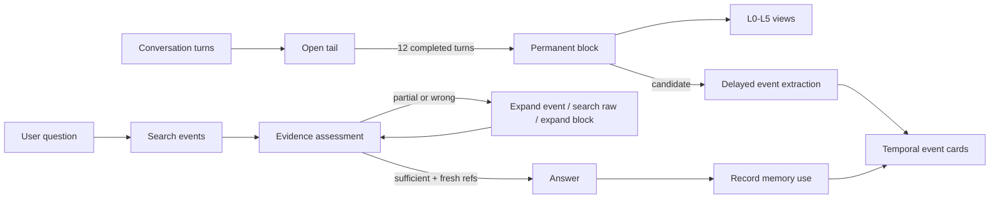

<div align="center">

# AgentMemory

### Evidence-gated, source-preserving memory for long-running AI agents

[](https://github.com/diqierjia/AgentMemory/actions/workflows/ci.yml)
[](LICENSE)
[](https://www.typescriptlang.org/)

[中文说明](README.zh-CN.md) · [Architecture](docs/ARCHITECTURE.md) · [Evaluation](docs/EVALUATION.md)

</div>

AgentMemory gives an agent a compact working memory without throwing away the conversation that produced it.

It keeps raw dialogue as permanent evidence, exposes older context through six progressively smaller layers, extracts durable events into time-aware cards, and requires an explicit evidence check before retrieved memory can be treated as fact.

The goal is not to make an agent claim that it remembers. The goal is to make every remembered answer inspectable.

## Why AgentMemory

Long-running assistants usually fail in one of two ways:

- Keep the full transcript forever: context grows without bound, costs rise, and useful details compete with noise.
- Replace history with summaries: prompts stay small, but dates, corrections, quotes, and provenance eventually disappear.

AgentMemory keeps both representations and gives them different jobs:

| Layer | Responsibility |
| --- | --- |
| Conversation blocks | Preserve every source message and reveal older context at the smallest useful detail level |
| Event cards | Make decisions, preferences, corrections, plans, and dated events searchable |
| Retrieval assessment | Decide whether the newest evidence is sufficient, partial, or wrong before answering |
| Adoption receipts | Reinforce only memories that were actually used, not every item that happened to be retrieved |

## What is different

### Raw evidence never becomes a summary

Every sealed conversation block retains an immutable L5 transcript. L0-L4 are views over that source, not replacements for it. An agent can start from a title, expand to key points, and return to the original message when exact wording matters.

### Retrieval is a loop, not a single similarity search

After each retrieval batch, the agent records five bounded fields:

```text
verdict · evidence_refs · fit · missing · next_strategy
```

Only `sufficient` with fresh evidence references and `next_strategy=answer` opens the answer gate. Otherwise the agent must expand an event, search raw memory, open a source block, or answer with explicit uncertainty when the budget ends.

### Time is part of the memory model

Event cards distinguish when something was mentioned from when it happened. They can also represent ranges, plans, cancellations, participants, ordering, corrections, and conflicts.

### Search does not train the ranking loop

A retrieval hit updates observability metadata only. Weight is reset only after the agent explicitly records that it used the memory. This avoids the feedback loop where frequently retrieved memories become permanently dominant just because they were retrieved.

### Corrections remain auditable

A corrected event is superseded and capped, not silently overwritten. Forgetting removes an event from retrieval without destroying its source trail.

## Quick start

AgentMemory currently ships as a TypeScript core library. Node.js 20+ is required.

```bash
git clone https://github.com/diqierjia/AgentMemory.git
cd AgentMemory
npm install
npm test
npm run build
```

Run the included example with your preferred TypeScript runner, or use the core directly:

```ts
import { AgentMemory } from '@diqier/agentmemory';

const memory = new AgentMemory({
  // Small only for this example. Production defaults to 12 turns per block.
  blockTurnSize: 1,
  summarizer: async (messages) => ({
    l0Title: 'API pagination decision',
    l0Tags: ['api', 'decision'],
    l1Summary: 'The team chose cursor pagination.',
    l2Keypoints: messages.map((message) => message.content),
    shouldExtract: true,
  }),
  extractor: async ({ target }) => ({
    shouldExtract: true,
    reason: 'The block contains a durable technical decision.',
    events: [{
      title: 'Use cursor pagination',
      summary: 'The public API should use cursor pagination.',
      sourceBlockId: target.id,
      sourceMessageIds: [target.l5Raw[0].id],
      tags: ['api', 'pagination'],
      temporal: { eventType: 'decision', status: 'occurred' },
    }],
  }),
});

await memory.appendTurn({
  user: 'Use cursor pagination for the public API.',
  assistant: 'Agreed.',
});

// Event extraction is delayed until the next block exists.
await memory.appendTurn({
  user: 'Now define the response envelope.',
  assistant: 'Let us continue.',
});

const results = memory.searchEvents('How should the API paginate?');
const freshEvidence = new Set(results.map(({ event }) => event.id));
const assessment = memory.assessRetrieval({
  verdict: 'sufficient',
  evidence_refs: [...freshEvidence],
  fit: 'The selected card records the decision.',
  missing: '',
  next_strategy: 'answer',
}, freshEvidence);

if (assessment.verdict === 'sufficient') {
  memory.recordMemoryUse(assessment.evidenceRefs);
}
```

The core owns memory rules and lifecycle state. LLM calls are adapter interfaces (`BlockSummarizer` and `EventExtractor`), so applications can choose their own provider, model, prompts, and storage boundary.

## How it works



### Six block layers

| Level | Content | Generated by | Purpose |
| --- | --- | --- | --- |
| L0 | Title and tags | Summarizer adapter | Old-context directory |
| L1 | Short narrative | Summarizer adapter | Topic-level recall |
| L2 | Key points | Summarizer adapter | Compact factual context |
| L3 | Rule-condensed transcript | Deterministic code | Remove only bounded redundancy |
| L4 | Readable near-verbatim transcript | Deterministic code | Review natural-language history |
| L5 | Complete raw messages and tool traces | Direct retention | Final evidence and audit source |

L3 is intentionally conservative. It removes standalone acknowledgements, raw tool-argument payloads, and exact repeated long pastes. It does not perform semantic rewriting. L5 always remains intact.

### Delayed event extraction

An event candidate from block `N` is extracted only after block `N+1` exists:

```text
previous block L2 + target block L5 + next block L2
```

Neighboring blocks provide context, but event facts and quotes may come only from the target block. This makes it possible to distinguish a durable decision from a passing remark without granting the extractor permission to invent cross-block provenance.

### Event cards

Each event card contains:

- a compact title, summary, narrative, tags, and optional quotes;
- source block and source message IDs;
- `mentionedAt` and `happenedStart` / `happenedEnd` as separate time axes;
- participants, event type, status, ordering, correction, and conflict links;
- criticality, confidence, lifecycle status, and adoption-based weight state.

See [Architecture](docs/ARCHITECTURE.md) for the complete contracts and design trade-offs.

## Evaluation: an engineering record, not a leaderboard

The completed development sequence below used one LoCoMo conversation (`conv-26`): 419 messages across 35 sessions and 152 category 1-4 questions. Extraction used `gpt-4o-mini`; answering and judging used `gpt-4o`.

That fixed slice is useful for detecting regressions between iterations. It is not a full LoCoMo score, does not establish generalization, and should not be compared directly with published full-dataset results.

| Iteration | Main change | Correct | Accuracy | What it showed |
| --- | --- | ---: | ---: | --- |
| 1 | 12-turn blocks, basic event cards, on-demand expansion | 67 / 152 | 44.08% | Raw evidence remained reachable, but event coverage and temporal recall were weak |
| 2 | Multiple events per block and explicit event time | 77 / 152 | 50.66% | Temporal accuracy improved; fragmented evidence became a new failure mode |
| 3 | Finer extraction, new read tools, assessment after every retrieval batch | 116 / 152 | 76.32% | The combined retrieval loop improved results; one adoption-protocol violation was found |
| 4 | Bounded assessment context and fixed end-of-budget adoption | 118 / 152 | 77.63% | Similar accuracy with about 10.35% fewer QA tokens and zero recorded protocol violations |
| 5 | Replaced the five-field gate with a larger structured scratchpad | 97 / 152 | 63.82% | More retrieval-state text made performance worse; the system returned to iteration 4's contract |

We publish the regression because it changed the design: a smaller, enforceable retrieval contract worked better than a more elaborate internal note.

Additional model-stack and judging controls are documented separately, without turning them into a headline score. See [Evaluation](docs/EVALUATION.md) for protocol fields, caveats, and the difference between development runs and comparable benchmarks.

## Current scope

Available now:

- dependency-free block condensation and progressive disclosure;
- permanent raw-message provenance;
- delayed event-extraction adapter boundary;
- time-aware event-card schema;
- lexical and temporal in-memory search reference implementation;
- evidence-gate normalization;
- adoption-only reinforcement, pin, forget, restore, and supersession;
- tests for the core invariants.

Not claimed yet:

- a production database adapter;
- an official npm release;
- provider-specific extraction prompts as a stable public API;
- embeddings, reranking, or graph retrieval in the open-source core;
- validated element-card/entity-state evaluation;
- a full-dataset LoCoMo result under one frozen, reproducible protocol.

## AgentMemory compared with common memory patterns

| Capability | Full transcript | Summary-only memory | Vector-only memory | AgentMemory |
| --- | ---: | ---: | ---: | ---: |
| Bounded routine context | No | Yes | Yes | Yes |
| Raw source preserved | Yes | Often no | External | Yes |
| Progressive detail expansion | No | No | No | Yes |
| Event time separate from mention time | No | Rarely | Metadata only | Yes |
| Explicit answer evidence gate | No | No | No | Yes |
| Retrieval hit separated from actual use | No | No | Rarely | Yes |
| Correction history retained | Transcript only | Often overwritten | Application-specific | Yes |

This is a design comparison, not a performance claim about every implementation in those categories.

## Repository layout

```text
src/
  blocks.ts       deterministic L3-L5 views and block-pointer decay
  retrieval.ts    five-field evidence gate
  store.ts        reference lifecycle and in-memory store
  types.ts        public block, event, temporal, and adapter contracts
  weights.ts      adoption-based event decay
tests/            executable invariants
examples/         minimal integration
docs/             architecture and evaluation protocol
benchmarks/       machine-readable development-run summaries
```

## Design principles

1. Preserve the source before optimizing context.
2. Derived memory must point back to evidence.
3. A search result is a candidate, not a fact.
4. Time, correction, and uncertainty belong in the data model.
5. Retrieval should not reinforce itself.
6. Benchmark configuration is part of the result.

## License

AgentMemory is available under the [MIT License](LICENSE).
