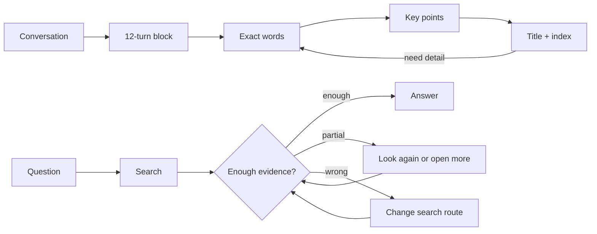

<div align="center">

# StrataGate

### Recent conversations stay verbatim. Older ones become an index. Answers wait for enough evidence.

[](https://github.com/diqierjia/StrataGate/actions/workflows/ci.yml)
[](LICENSE)
[](https://www.typescriptlang.org/)

[中文说明](README.zh-CN.md) · [Architecture](docs/ARCHITECTURE.md) · [Evaluation](docs/EVALUATION.md)

</div>

StrataGate is a memory system for AI agents. It is built around two simple rules.

## 1. Memory should get lighter with distance, not disappear

```text
Just happened                                              Long ago
exact words  →  readable transcript  →  key points  →  title + index
     ↑                                                       ↓
     └──────── open only the needed memory back to source ───┘
```

StrataGate seals every 12 completed conversation turns into one permanent block. New blocks stay close to the original words. As the conversation moves on, older blocks appear in shorter forms. The full source is still there and can be opened again when a question needs a date, condition, correction, or exact quote.

The result is small everyday context without throwing old conversations away.

## 2. Finding something is not the same as having an answer

After every search, StrataGate asks one plain question: **is the newest evidence enough?**

```text
Enough          → answer
Only part of it → keep looking or open more detail
Wrong result    → change the search route
```

Only the first path opens the answer gate. If the search budget ends while evidence is still incomplete, the agent must say that it is unsure instead of turning a related memory into a fact.

These two rules are the heart of StrataGate: **memory has depth, and answers have a gate.**

## Why this exists

Most long-running assistants choose one of two bad compromises:

- Send the whole conversation every time. Nothing is lost, but context keeps growing and useful details drown in noise.
- Replace old conversation with summaries. Context stays small, but dates, wording, and corrections eventually vanish.

StrataGate keeps the source and the smaller views together. The agent sees only the detail it needs now and can move back down to the original words later.

## What happens to one conversation

A user message and its assistant reply count as one turn. After 12 completed turns, StrataGate creates one block with six views of the same conversation:

| View | What the agent sees | Plain meaning |
| --- | --- | --- |
| L0 | Title and tags | An index entry |
| L1 | Short summary | What this part was about |
| L2 | Key points | The important facts |
| L3 | Lightly cleaned transcript | Original conversation with only fixed kinds of clutter removed |
| L4 | Readable near-original transcript | Almost every natural-language word |
| L5 | Complete raw messages and tool records | The source |

L3 does not ask a model to rewrite the conversation. Code removes only standalone greetings, pure confirmations, raw tool arguments, and exact repeated long pastes. L5 always remains complete.

Older blocks normally show a shallower view. Opening a block lifts only that block to the requested depth; it does not flood the whole prompt with old history.

> Twelve turns is the current tested default, not a claim that 12 is universally optimal. A 6/12/24-turn comparison has not been completed yet.

## What happens before an answer

The agent searches in small steps. After each new result, it records five short fields:

```text
verdict · evidence_refs · fit · missing · next_strategy
```

In everyday language:

- `verdict`: enough, partial, or wrong;
- `evidence_refs`: which new results actually support the answer;
- `fit`: why those results match the question;
- `missing`: what is still absent;
- `next_strategy`: answer, search again, or open more detail.

A result can pass only when it is marked `sufficient`, cites evidence from the newest search batch, and chooses `answer` as the next step.

## Quick start

StrataGate currently ships as a TypeScript core library. Node.js 20+ is required.

```bash
git clone https://github.com/diqierjia/StrataGate.git
cd StrataGate
npm install
npm test
npm run build
```

```ts
import { StrataGate } from '@diqier/stratagate';

const memory = new StrataGate({
  // One turn only to keep this example short. The real default is 12.
  blockTurnSize: 1,

  summarizer: async (messages) => ({
    l0Title: 'API pagination decision',
    l0Tags: ['api', 'decision'],
    l1Summary: 'The team chose cursor pagination.',
    l2Keypoints: messages.map((message) => message.content),
    shouldExtract: true,
  }),

  extractor: async ({ target }) => ({
    shouldExtract: true,
    reason: 'This is a decision worth finding later.',
    events: [{
      title: 'Use cursor pagination',
      summary: 'The public API should use cursor pagination.',
      sourceBlockId: target.id,
      sourceMessageIds: [target.l5Raw[0].id],
      tags: ['api', 'pagination'],
    }],
  }),
});

await memory.appendTurn({
  user: 'Use cursor pagination for the public API.',
  assistant: 'Agreed.',
});

// Extraction waits for the following block, so it can tell a lasting
// decision from a passing remark without taking quotes from a neighbor.
await memory.appendTurn({
  user: 'Now define the response envelope.',
  assistant: 'Let us continue.',
});

const results = memory.searchEvents('How should the API paginate?');
const newestEvidence = new Set(results.map(({ event }) => event.id));

const check = memory.assessRetrieval({
  verdict: 'sufficient',
  evidence_refs: [...newestEvidence],
  fit: 'The selected memory records the decision.',
  missing: '',
  next_strategy: 'answer',
}, newestEvidence);

if (check.verdict === 'sufficient') {
  memory.recordMemoryUse(check.evidenceRefs);
}
```

The core owns the memory rules. Applications provide the model calls through two small interfaces: one that creates the short block views and one that extracts lasting events. No model provider is built into the core.

## The whole flow



## Helpful memory around those two rules

StrataGate also keeps searchable event cards for decisions, preferences, plans, and corrections. Each card points to its source block and messages. Event time and message time are stored separately so a question about when something happened is not answered with the date it was mentioned.

These are supporting abilities. The main design remains the changing depth of old conversation and the evidence check before answering.

## Search should not make itself stronger

Simply finding a memory does not increase its long-term weight. A memory becomes stronger only after the answer actually uses it. This avoids a loop where frequently returned memories keep winning future searches merely because they were returned before.

Corrections also keep their history. A newer event can replace an older one without deleting the old source. A forgotten event leaves search but keeps its record unless an application explicitly deletes it.

## Evaluation: a development record, not a leaderboard

The completed sequence below used one LoCoMo conversation (`conv-26`): 419 messages, 35 sessions, and 152 category 1-4 questions. Extraction used `gpt-4o-mini`; answering and judging used `gpt-4o`.

This fixed slice helped us find improvements and regressions. It is not a full LoCoMo score and should not be compared directly with another project's full-dataset result.

| Run | What changed | Correct | Accuracy | What we learned |
| --- | --- | ---: | ---: | --- |
| 1 | 12-turn blocks, basic event cards, open older blocks when needed | 67 / 152 | 44.08% | The source stayed reachable, but too few useful events were found |
| 2 | Allow several events from one block and store event time separately | 77 / 152 | 50.66% | Time questions improved, but answers sometimes needed facts from several cards |
| 3 | Better extraction, more ways to open memory, and a check after every search | 116 / 152 | 76.32% | The complete search loop helped; one incorrect memory-use record was found |
| 4 | Keep the evidence check short and fix the end-of-budget rule | 118 / 152 | 77.63% | Similar accuracy with about 10.35% fewer QA tokens and no recorded rule violations |
| 5 | Replace the five short fields with a larger internal note | 97 / 152 | 63.82% | More internal text made retrieval worse, so we returned to run 4's smaller gate |

The failed fifth run matters: it is the reason the evidence gate stays small and strict.

Different model and judge experiments are kept in [Evaluation](docs/EVALUATION.md), with their limits stated next to the numbers instead of mixing them into this improvement curve.

## What is ready today

- permanent conversation blocks and six levels of detail;
- deterministic L3-L5 views;
- block expansion that opens only the needed history;
- an adapter for delayed event extraction;
- searchable event cards and raw-message fallback;
- the three-way evidence check;
- memory use, pin, forget, restore, and correction rules;
- tests for the core behavior.

## What is not claimed yet

- a production database adapter;
- a published npm package;
- a built-in model provider;
- embedding, reranking, or graph search in the open-source core;
- proof that 12 turns is better than every other block size;
- a full LoCoMo result under one frozen end-to-end setup.

## Repository layout

```text
src/
  blocks.ts       how one conversation moves between exact words and an index
  retrieval.ts    the three-way evidence gate
  store.ts        the working in-memory reference implementation
  types.ts        the public data shapes and model adapter interfaces
  weights.ts      how actually used memories stay stronger for longer
tests/            the rules expressed as executable tests
examples/         a small integration example
docs/             deeper architecture and evaluation details
benchmarks/       machine-readable development-run summaries
```

## License

StrataGate is available under the [MIT License](LICENSE).
