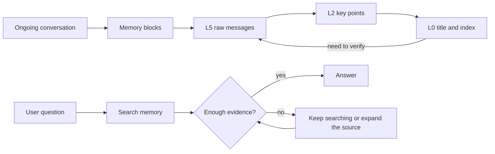

<div align="center">

# StrataGate

### Keep nearby conversations verbatim and distant ones as an index. Answer only when the evidence is sufficient.

[](https://github.com/diqierjia/StrataGate/actions/workflows/ci.yml)
[](LICENSE)
[](https://www.typescriptlang.org/)

[中文说明](README.zh-CN.md) · [Architecture](docs/ARCHITECTURE.md) · [Evaluation](docs/EVALUATION.md)

</div>

StrataGate is a TypeScript memory kernel for long-running AI agents.

It primarily addresses two problems:

- As a conversation grows, how can everyday context stay small without losing dates, corrections, or original wording?
- After relevant history is found, how can an agent avoid presenting something that merely looks relevant as fact?

StrataGate stores conversation history as memory blocks that can be expanded one layer at a time, then places an evidence gate before every answer.

> [!NOTE]
> This repository currently provides the core rules and an in-memory reference implementation. Node.js 20 or later is required.
> The npm package has not been officially published, and there is no production database adapter or built-in model service yet.

## Understand StrataGate in one minute



One user message and one assistant response count as a turn. By default, every 12 turns form a memory block. This value is configurable.

Each block preserves several levels of detail at the same time. Old blocks normally use very little context. When a question depends on a date, exact wording, a condition, or a correction, only the relevant block is expanded. Shorter views never overwrite the complete source.

Retrieval is not “search once, then answer.” Every new batch of results must pass a constrained evidence check. When the evidence is incomplete, the next step can only be to continue searching, expand an event, inspect the raw messages, or state the uncertainty clearly.

## Quick start

Because the npm package has not been officially published, run StrataGate from source for now:

```bash
git clone https://github.com/diqierjia/StrataGate.git
cd StrataGate
npm install
npm test
npm run build
```

The example below runs a minimal workflow:

1. Store two pieces of conversation.
2. Extract a technical decision from the first one.
3. Search for that decision.
4. Assess the evidence.
5. Record its use and output the answer only when the evidence is sufficient.

Save the code as `demo.mjs` in the repository root:

```js
import { StrataGate } from './dist/index.js';

const memory = new StrataGate({
  // Use one turn here so the example creates a block immediately.
  // The actual default is 12.
  blockTurnSize: 1,

  summarizer: async (messages) => ({
    l0Title: 'API pagination approach',
    l0Tags: ['api', 'decision'],
    l1Summary: 'The team decided to use cursor pagination for the public API.',
    l2Keypoints: messages.map((message) => message.content),
    shouldExtract: true,
  }),

  extractor: async ({ target }) => ({
    shouldExtract: true,
    reason: 'The target block contains a technical decision that will matter later.',
    events: [{
      title: 'Use cursor pagination for the public API',
      summary: 'The public API should use cursor pagination instead of page-number pagination.',
      sourceBlockId: target.id,
      sourceMessageIds: [target.l5Raw[0].id],
      tags: ['api', 'pagination'],
      temporal: {
        eventType: 'decision',
        status: 'occurred',
      },
    }],
  }),
});

await memory.appendTurn({
  user: 'Use cursor pagination for the public API.',
  assistant: 'Understood. I will treat it as the current API design decision.',
});

// Event extraction processes the previous block only after a later block appears.
await memory.appendTurn({
  user: 'Next, define the response structure.',
  assistant: 'Let us continue.',
});

const results = memory.searchEvents('How should the API paginate?');
const latestEvidence = new Set(
  results.map(({ event }) => event.id),
);

const assessment = memory.assessRetrieval({
  verdict: 'sufficient',
  evidence_refs: [...latestEvidence],
  fit: 'The retrieved event card directly records the pagination approach.',
  missing: '',
  next_strategy: 'answer',
}, latestEvidence);

if (assessment.verdict === 'sufficient') {
  memory.recordMemoryUse(assessment.evidenceRefs);
  console.log(results[0]?.event.summary);
} else {
  console.log('The current evidence is insufficient, so no definitive answer can be given yet.');
}
```

Run it:

```bash
node demo.mjs
```

The `summarizer` and `extractor` in this example are hard-coded callbacks. In a real integration, these interfaces can call any model or provider.

See [`examples/basic.ts`](examples/basic.ts) for the complete TypeScript example in this repository.

## Conversation blocks: summaries never overwrite the source

Each memory block has six views:

| Level | Contents | How it is produced |
| --- | --- | --- |
| L0 | Title and tags | `BlockSummarizer` |
| L1 | Short summary | `BlockSummarizer` |
| L2 | Key points | `BlockSummarizer` |
| L3 | Rule-pruned conversation | Deterministic code |
| L4 | Readable near-verbatim conversation | Deterministic code |
| L5 | Complete messages and tool records | Preserved directly |

L3 does not allow a model to rewrite freely. It removes only narrowly defined content, such as standalone greetings, pure acknowledgements, raw tool arguments, and identical repeated long passages.

L5 is always the final source of truth. Here, “preserved” means that shorter views never overwrite the original messages. Persistence across processes depends on the storage implementation supplied by the integrator. This repository currently provides only an in-memory reference implementation.

The default block size is 12 turns, but that is only the default used by the current implementation and experiments. It is not a claim that 12 turns are optimal for every setting.

## Event cards: make important memories searchable

Conversation blocks preserve the source. Event cards make important information easier to find.

Event cards are suitable for representing:

- decisions;
- preferences;
- plans;
- corrections;
- time-related events.

Every event card records its source block and source messages. The time when an event happened is stored separately from the time when it was mentioned, so the system does not mistake “when the conversation happened” for “when the event happened.”

Event extraction is delayed by one block by default. When extracting block `N`, adjacent blocks may provide context, but the facts and citations of a new event can come only from block `N` itself.

## Evidence gate: relevant does not mean sufficient

Each batch of search results produces five fields:

| Field | Meaning |
| --- | --- |
| `verdict` | The evidence is sufficient, only partial, or wrong |
| `evidence_refs` | Which items in the latest result batch actually support the answer |
| `fit` | Why this evidence answers the current question |
| `missing` | What is still missing |
| `next_strategy` | Answer, search again, or expand more source material |

A `sufficient` verdict is accepted only when all three conditions below are met:

1. At least one cited piece of evidence comes from the latest retrieval batch.
2. The next step explicitly selects `answer`.
3. The assessment conforms to the constrained field structure.

Otherwise, the core downgrades the result to `partial` or `wrong`.

StrataGate provides the evidence gate and state rules. The integration is still responsible for the tool-calling loop and the model that produces the final answer.

## Search hits do not reinforce memory automatically

A search hit only means that a memory was found. It does not mean the answer actually used it.

An event's long-term weight is updated only after `recordMemoryUse()` records that it was actually used. This prevents a memory from reinforcing itself and dominating future rankings simply because it appears frequently in search results.

Corrections do not overwrite history directly. A new event can supersede an old one, while the old event and its source remain available. Forgetting removes an event from search; it does not delete the original conversation by default.

## Evaluation record

The current public experiments document development iterations and help identify regressions. They are not presented as leaderboard scores.

Five development runs used the same LoCoMo conversation (`conv-26`), containing 419 messages, 35 sessions, and 152 category 1–4 questions.

The two results that most directly shaped the current design are:

| Configuration | Correct | Accuracy |
| --- | ---: | ---: |
| Five-field evidence gate with constrained assessment context | 118 / 152 | 77.63% |
| Replaced it with a more complex retrieval note | 97 / 152 | 63.82% |

The more complex internal retrieval state caused a clear regression, so the current implementation keeps the shorter, enforceable five-field contract.

This is a fixed development slice, not a complete LoCoMo evaluation, and it cannot be compared directly with full-dataset results from other projects. See [`docs/EVALUATION.md`](docs/EVALUATION.md) for the complete experiment history, model configuration, and Judge sensitivity.

## Current scope

Available today:

- L0–L5 layered conversation blocks;
- deterministic L3–L5 source views;
- on-demand expansion of individual historical blocks;
- a delayed event extraction interface;
- event cards with source and time information;
- event search and raw-message lookup;
- a three-way evidence gate;
- weight updates after actual use;
- pinning, forgetting, restoring, and event supersession;
- tests for core behavior.

Not yet provided:

- a production database adapter;
- an officially published npm package;
- a built-in model service;
- embeddings, reranking, or graph retrieval;
- a unified end-to-end result on the complete LoCoMo dataset;
- evidence that a 12-turn block size is better than other configurations.

StrataGate is therefore currently best suited for:

- researching or building traceable agent memory systems;
- validating layered context and evidence-gate designs;
- serving as the memory kernel inside an existing agent framework.

It is not yet a hosted memory service that can be installed and used directly in production.

## Repository layout

```text
src/
  blocks.ts       conversation block layering and decay
  retrieval.ts    evidence assessment contract
  store.ts        in-memory reference implementation
  types.ts        data structures and adapter interfaces
  weights.ts      memory weight rules

tests/            tests for core rules
examples/         minimal integration example
docs/             architecture and evaluation documentation
benchmarks/       machine-readable experiment records
```

## License

StrataGate is available under the [MIT License](LICENSE).
