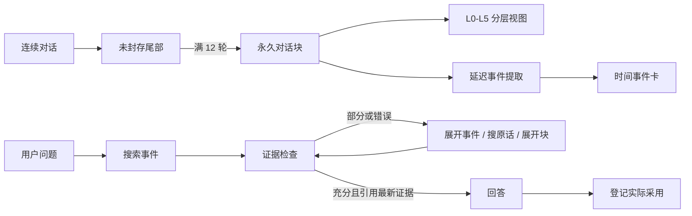

<div align="center">

# AgentMemory

### 一个保留原始证据、回答前检查证据是否充分的智能体记忆系统

[English](README.md) · [架构](docs/ARCHITECTURE.md) · [实验](docs/EVALUATION.md)

</div>

AgentMemory 让长期运行的智能体保持紧凑上下文，同时不丢掉产生这些记忆的原始对话。

系统永久保存原话，把较早对话按 L0-L5 六个层级逐步收缩；值得长期记住的决定、偏好、纠正、计划和事件会被整理成带时间信息的事件卡。检索结果不能直接当成事实，只有通过明确的证据检查后才能用于确定回答。

我们的目标不是让智能体“看起来记得”，而是让每一次记得都有出处。

## 为什么做 AgentMemory

长期对话通常有两个极端：

- 每次发送全部历史：上下文、成本和干扰不断增长。
- 很早就把历史压成摘要：日期、原话、纠正和来源会逐渐消失。

AgentMemory 同时保留两种表示，并让它们各司其职：

| 组成 | 作用 |
| --- | --- |
| 对话块 | 永久保存来源，并按需要展示合适的详细程度 |
| 事件卡 | 让决定、偏好、纠正、计划和带日期的事件可以被搜索 |
| 证据检查 | 回答前判断最新证据是充分、部分相关还是错误 |
| 采纳回执 | 只强化真正被回答采用的记忆，不强化所有搜索命中 |

## 核心特点

### 原话不会被摘要替代

每个封存的对话块都永久保留 L5 完整原始记录。L0-L4 只是同一来源的不同视图，不会覆盖 L5。智能体可以先看标题，需要时逐层展开，最后回到原话核对。

### 检索不是“一搜就答”

每批检索之后必须填写五个受限字段：

```text
verdict · evidence_refs · fit · missing · next_strategy
```

只有 `verdict=sufficient`、证据引用来自最新一批结果、并且 `next_strategy=answer` 时，回答门才会打开。否则必须继续展开事件、搜索原始记忆、展开来源块，或者在预算耗尽时明确表达不确定性。

### 时间是一等数据

事件卡把“什么时候提到”和“什么时候发生”分开保存，也能表示时间范围、计划、取消、参与者、先后关系、纠正和冲突。

### 搜到不等于用到

搜索命中只更新调试信息，不重置长期权重。只有智能体明确登记“这次回答实际采用了哪些记忆”，这些记忆才会被强化，避免排名形成自我循环。

### 纠正不会抹掉历史

旧事件被纠正后会标记为已取代并限制权重，而不是被覆盖。遗忘操作会让事件退出检索，但仍保留来源链路。

## 快速开始

目前提供 TypeScript 核心库，需要 Node.js 20 或更高版本。

```bash
git clone https://github.com/diqierjia/AgentMemory.git
cd AgentMemory
npm install
npm test
npm run build
```

最小示例见 [`examples/basic.ts`](examples/basic.ts)。核心库负责记忆规则和生命周期；`BlockSummarizer` 与 `EventExtractor` 是模型适配接口，使用者可以自行选择模型、服务商、提示词和存储实现。

## 工作流程



### L0-L5 六层对话块

| 层级 | 内容 | 生成方式 |
| --- | --- | --- |
| L0 | 标题和标签 | 摘要适配器 |
| L1 | 简短叙事摘要 | 摘要适配器 |
| L2 | 关键点 | 摘要适配器 |
| L3 | 规则精简对话 | 确定性代码 |
| L4 | 可读近原文 | 确定性代码 |
| L5 | 完整消息和工具记录 | 直接永久保存 |

L3 只删除范围明确的冗余：独立寒暄、纯确认、工具参数原始载荷和完全相同的长段重复粘贴。它不做语义改写，L5 始终完整保留。

### 延迟事件提取

第 N 个块不会立刻精提取，而是等第 N+1 个块存在后再处理：

```text
前一块 L2 + 目标块 L5 + 后一块 L2
```

前后块只用于理解上下文，事件事实和原话只能来自目标块。这能帮助系统区分长期决定和随口一提，同时保留清晰来源。

## 实验：研发记录，不是排行榜

下面五轮使用 LoCoMo 的同一个 conversation（`conv-26`）：419 条消息、35 个 sessions，排除 category 5 后共 152 题。提取模型为 `gpt-4o-mini`，回答和 Judge 为 `gpt-4o`。

这组固定切片适合观察迭代方向和发现回归，但不能代表完整 LoCoMo，也不能直接与其他项目公开的全量成绩比较。

| 轮次 | 主要变化 | 正确题数 | 准确率 | 得到的结论 |
| --- | --- | ---: | ---: | --- |
| 1 | 12 轮块、基础事件卡、按需展开 | 67 / 152 | 44.08% | 原话可以回看，但事件覆盖和时间题较弱 |
| 2 | 一个块拆成多张事件卡，单独保存事件发生时间 | 77 / 152 | 50.66% | 时间题改善，同时暴露跨卡综合问题 |
| 3 | 更细提取、新读取工具、每批检索后检查证据 | 116 / 152 | 76.32% | 整套检索闭环有效；发现 1 题采纳协议违规 |
| 4 | 缩短证据检查上下文，修复预算结束时的错误登记 | 118 / 152 | 77.63% | 准确率基本保持，QA Token 少约 10.35%，协议违规归零 |
| 5 | 五字段检查改成更复杂的结构化临时便签 | 97 / 152 | 63.82% | 更复杂的检索状态反而造成回归，因此回到第四轮合同 |

第五轮的下降也公开保留，因为它真正改变了设计：小而能强制执行的证据合同，比更复杂的内部便签更可靠。

其他模型栈和 Judge 敏感性实验放在 [实验说明](docs/EVALUATION.md) 中，不用作首页宣传成绩。

## 当前边界

已经提供：

- 对话块分层与确定性精简；
- 永久原始消息来源；
- 延迟事件提取适配接口；
- 带时间轴的事件卡结构；
- 词法与时间检索参考实现；
- 五字段证据门；
- 采纳后强化、置顶、遗忘、恢复和纠正；
- 核心规则测试。

暂不宣称：

- 已有生产级数据库适配器；
- 已发布正式 npm 包；
- 已稳定公开某一家模型的提取提示词；
- 开源核心已包含 embedding、rerank 或图检索；
- 元素卡已经得到有效评测；
- 已取得完整 LoCoMo、统一协议下的公开成绩。

## 设计原则

1. 先保存来源，再优化上下文。
2. 派生记忆必须能回到证据。
3. 搜索结果只是候选，不是事实。
4. 时间、纠正和不确定性属于数据模型。
5. 检索不能自动强化自身。
6. 实验配置也是实验结果的一部分。

## 许可证

AgentMemory 使用 [MIT License](LICENSE)。
