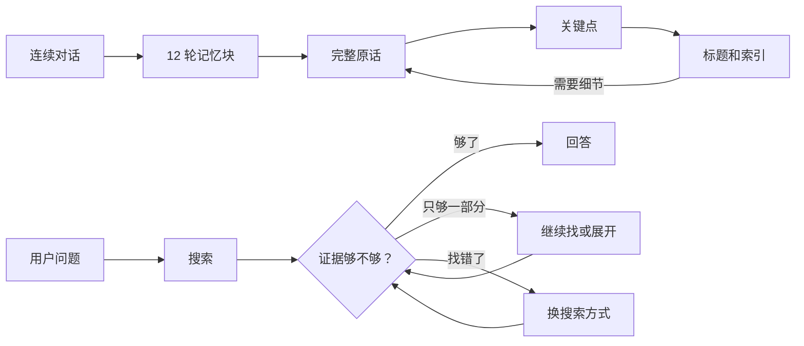

<div align="center">

# 🧠 StrataGate

### 近处保留原话，远处只看索引；证据够了才回答。

[English](README.md) · [架构细节](docs/ARCHITECTURE.md) · [实验说明](docs/EVALUATION.md)

</div>

StrataGate 是一个给智能体使用的记忆系统。整个系统最重要的就是两件事。

## 🪶 一、记忆离得越远，显示得越轻，但不会消失

```text
刚刚发生                                                很久以前
完整原话  →  可读对话  →  关键点  →  标题和索引
    ↑                                                   ↓
    └──────── 需要细节时，只把这一段翻回原话 ────────────┘
```

StrataGate 默认把每 12 轮完整对话封存成一个永久记忆块。刚聊过的内容仍然显示原话；随着对话继续，较早的块会逐渐只显示要点、摘要，最后只显示标题和索引。

这不是把原话删掉。完整记录一直保留。遇到日期、条件、纠正或原话问题时，智能体可以只展开相关的那个块，一层层翻回完整对话，不需要把全部历史重新塞进上下文。

这样，平时看到的内容很轻，需要细节时又找得回来。

## 🚦 二、搜到相关内容，不代表已经找到答案

每次搜索以后，StrataGate 都先问一句：**最新找到的证据够不够？**

```text
证据够了       → 回答
只够一部分     → 继续找，或者展开更多细节
找错了         → 换一种搜索方式
```

只有第一种情况才能进入回答。如果搜索次数已经用完，证据仍然不完整，智能体必须说自己不确定，不能把“看起来相关”说成确定事实。

这就是 StrataGate 的核心：**记忆有深浅，回答有门槛。**

## 💡 为什么要这样做

长期对话通常会走向两个极端：

- 每次都发送全部聊天记录：什么都没有丢，但上下文越来越长，真正重要的信息被淹没。
- 很早就把聊天压成摘要：上下文变短了，但日期、原话和后来发生的纠正会逐渐消失。

StrataGate 把原话和较短的版本一起保存。智能体平时只看当前需要的详细程度，以后仍然能沿着索引翻回原话。

## 🧱 一段对话会怎样变化

一条用户消息和一条助手回复算一轮。满 12 轮以后，这段对话会形成一个记忆块。同一段内容有六种详细程度：

| 层级 | 智能体看到什么 | 人话解释 |
| --- | --- | --- |
| L0 | 标题和标签 | 一条索引 |
| L1 | 简短摘要 | 这一段大概聊了什么 |
| L2 | 关键点 | 重要事实 |
| L3 | 规则精简后的对话 | 只去掉范围明确的杂项 |
| L4 | 几乎完整的可读对话 | 保留自然语言原话 |
| L5 | 完整消息和工具记录 | 最终来源 |

L3 不让模型自由改写内容。代码只会去掉独立寒暄、纯确认、工具参数原始载荷和完全相同的长段重复粘贴。L5 永远完整保留。

较早的块通常只显示较浅的一层。展开记忆时，也只展开当前需要的块，不会把全部旧对话一起灌回上下文。

> 12 轮是目前已经实现并用于实验的默认值，不代表我们已经证明 12 轮在所有场景下都是最优。6、12、24 轮之间的正式对照还没有完成。

## 🔎 回答之前具体检查什么

每获得一批新的搜索结果，系统会记录五个很短的字段：

```text
verdict · evidence_refs · fit · missing · next_strategy
```

翻成人话就是：

- `verdict`：证据够了、只够一部分，还是找错了；
- `evidence_refs`：最新结果里，哪几条真的能支持答案；
- `fit`：为什么这些内容和问题对得上；
- `missing`：还缺什么；
- `next_strategy`：现在回答、继续搜索，还是展开更多细节。

只有同时满足三个条件才能通过：判断为“充分”、引用来自最新一批结果、下一步明确选择回答。

## 🚀 快速开始

StrataGate 目前提供 TypeScript 核心库，需要 Node.js 20 或更高版本。

```bash
git clone https://github.com/diqierjia/StrataGate.git
cd StrataGate
npm install
npm test
npm run build
```

```ts
import { StrataGate } from '@diqier/stratagate';

const memory = new StrataGate({
  // 为了让示例更短，这里设为 1；真实默认值是 12。
  blockTurnSize: 1,

  summarizer: async (messages) => ({
    l0Title: 'API 分页决定',
    l0Tags: ['api', 'decision'],
    l1Summary: '团队决定使用游标分页。',
    l2Keypoints: messages.map((message) => message.content),
    shouldExtract: true,
  }),

  extractor: async ({ target }) => ({
    shouldExtract: true,
    reason: '这是以后还要用到的技术决定。',
    events: [{
      title: '使用游标分页',
      summary: '公开 API 使用游标分页。',
      sourceBlockId: target.id,
      sourceMessageIds: [target.l5Raw[0].id],
      tags: ['api', 'pagination'],
    }],
  }),
});
```

核心库负责记忆规则。调用什么模型、使用哪家服务，由接入方通过两个小接口决定：一个接口生成记忆块的短版本，另一个接口提取以后值得重新找到的事件。

## 🔄 完整流程



## 🗂️ 围绕这两个核心，还有哪些辅助能力

系统会把决定、偏好、计划和纠正整理成可以搜索的事件卡。每张卡都指向来源记忆块和消息。事情发生的时间与“什么时候在聊天里提到它”分开保存，避免把聊天日期误当成事件日期。

这些是辅助能力。项目最重要的设计仍然是：旧对话会改变显示深度，回答前必须检查证据。

## ⚖️ 搜到一次，不会自动越来越重要

一条记忆仅仅被搜索出来，不会提高它的长期权重。只有回答真正采用它以后，它才会变得更不容易淡出。这样可以避免某条记忆因为以前经常被搜到，就永远霸占后面的搜索结果。

纠正也不会抹掉历史。新事件可以取代旧事件，但旧来源仍然保留。遗忘会让一条事件退出搜索，不会默认删除其来源。

## 📊 实验：记录研发过程，不做排行榜

下面五轮实验使用 LoCoMo 的同一个 conversation（`conv-26`）：419 条消息、35 个 sessions，排除 category 5 后共 152 题。提取模型为 `gpt-4o-mini`，回答和 Judge 为 `gpt-4o`。

这组固定题目适合发现改进和回归，但不能代表完整 LoCoMo，也不能直接和其他项目的全量成绩比较。

| 轮次 | 改了什么 | 正确题数 | 准确率 | 得到的结论 |
| --- | --- | ---: | ---: | --- |
| 1 | 12 轮记忆块、基础事件卡、需要时展开旧块 | 67 / 152 | 44.08% | 原话能找回来，但提取出的有用事件太少 |
| 2 | 一个块可以提取多张事件卡，并单独保存事情发生时间 | 77 / 152 | 50.66% | 时间题改善，但有些答案需要综合多张卡 |
| 3 | 改进提取、增加读取方式、每批搜索后检查证据 | 116 / 152 | 76.32% | 完整搜索闭环有效；同时发现 1 题错误登记了记忆使用 |
| 4 | 缩短证据检查内容，修复搜索次数用完后的登记规则 | 118 / 152 | 77.63% | 准确率基本保持，QA Token 少约 10.35%，没有再发现协议违规 |
| 5 | 把五个短字段换成更复杂的内部便签 | 97 / 152 | 63.82% | 内部文字变多以后效果反而下降，因此恢复第四轮的小型证据门 |

第五轮的下降值得保留，因为它直接决定了现在的设计：证据检查应该短、明确、能够强制执行。

使用其他模型和 Judge 的实验单独放在[实验说明](docs/EVALUATION.md)中，并在分数旁边写清楚限制，不混进这条迭代曲线。

## ✅ 现在已经能做什么

- 永久保存 12 轮记忆块，并提供六种详细程度；
- 只展开当前需要的旧对话；
- 延迟提取以后值得重新找到的事件；
- 搜索事件，或者直接回查原始消息；
- 把证据分成充分、部分相关和错误；
- 记录真正被回答采用的记忆；
- 置顶、遗忘、恢复和纠正记忆；
- 用测试固定核心规则。

## 🚧 现在还不能宣称什么

- 已有生产级数据库适配器；
- 已经发布正式 npm 包；
- 已内置某一家模型服务；
- 开源核心已经包含 embedding、rerank 或图检索；
- 已证明 12 轮优于所有其他块大小；
- 已完成统一端到端配置下的完整 LoCoMo 评测。

## 📁 项目结构

```text
src/
  blocks.ts       同一段对话怎样从原话逐渐变成索引
  retrieval.ts    回答前的三种证据判断
  store.ts        可以直接运行的内存版实现
  types.ts        数据结构和模型接口
  weights.ts      真正用过的记忆怎样保持得更久
tests/            把核心规则写成可以运行的测试
examples/         最小接入示例
docs/             更深入的架构和实验说明
benchmarks/       可以被程序读取的实验记录
```

## 📄 许可证

StrataGate 使用 [MIT License](LICENSE)。
