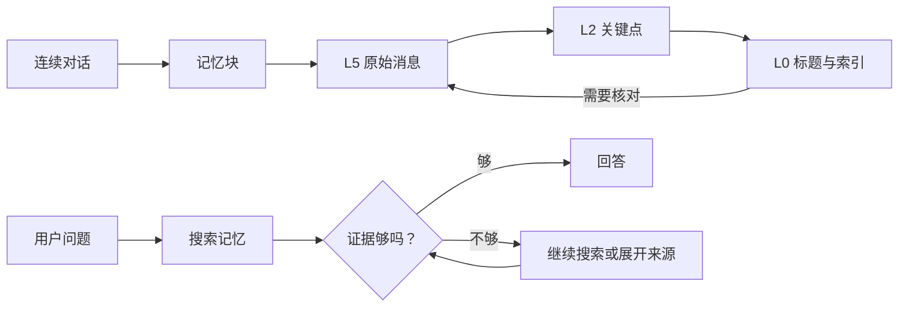

<div align="center">

# StrataGate

### 近处保留原话，远处只看索引；证据够了才回答。

[](https://github.com/diqierjia/StrataGate/actions/workflows/ci.yml)
[](LICENSE)
[](https://www.typescriptlang.org/)

[English](README.md) · [架构说明](docs/ARCHITECTURE.md) · [评测记录](docs/EVALUATION.md)

</div>

StrataGate 是一个给长期运行 AI Agent 使用的 TypeScript 记忆内核。

它主要解决两个问题：

- 对话越来越长以后，怎样缩短日常上下文，同时保留日期、纠正和原始措辞；
- 从历史中搜到相关内容以后，怎样避免 Agent 把“看起来相关”直接说成事实。

StrataGate 的做法是把历史对话保存为可逐层展开的记忆块，并在回答前加一道证据门。

> [!NOTE]
> 当前仓库提供核心规则和内存参考实现，需要 Node.js 20 或更高版本。
> npm 包尚未正式发布，也还没有生产级数据库适配器或内置模型服务。

## 一分钟理解 StrataGate



一条用户消息和一条助手回复算一轮。默认每 12 轮形成一个记忆块，这个值可以配置。

同一个块同时保留多个详细程度。旧块平时只占用很少的上下文；遇到日期、原话、条件或纠正问题时，再单独展开相关块。较短的视图不会覆盖完整来源。

检索也不是“一搜就答”。每批新结果都必须经过一次受限的证据检查。证据不完整时，下一步只能继续搜索、展开事件、回查原始消息，或者明确表达不确定。

## 快速开始

由于 npm 包尚未正式发布，目前先从源码运行：

```bash
git clone https://github.com/diqierjia/StrataGate.git
cd StrataGate
npm install
npm test
npm run build
```

下面的示例完成一条最小流程：

1. 保存两段对话；
2. 从第一段中提取一个技术决定；
3. 搜索这个决定；
4. 检查证据；
5. 只有证据充分时才登记使用并输出答案。

将代码保存为仓库根目录下的 `demo.mjs`：

```js
import { StrataGate } from './dist/index.js';

const memory = new StrataGate({
  // 为了让示例立即形成记忆块，这里设为 1。
  // 实际默认值是 12。
  blockTurnSize: 1,

  summarizer: async (messages) => ({
    l0Title: 'API 分页方案',
    l0Tags: ['api', 'decision'],
    l1Summary: '团队决定公开 API 使用游标分页。',
    l2Keypoints: messages.map((message) => message.content),
    shouldExtract: true,
  }),

  extractor: async ({ target }) => ({
    shouldExtract: true,
    reason: '目标块中包含一个以后还会用到的技术决定。',
    events: [{
      title: '公开 API 使用游标分页',
      summary: '公开 API 应使用游标分页，而不是页码分页。',
      sourceBlockId: target.id,
      sourceMessageIds: [target.l5Raw[0].id],
      tags: ['api', 'pagination'],
      temporal: {
        eventType: 'decision',
        status: 'occurred',
      },
    }],
  }),
});

await memory.appendTurn({
  user: '公开 API 使用游标分页。',
  assistant: '好，我会把它作为当前的 API 设计决定。',
});

// 事件提取会等到后一个块出现后再处理前一个块。
await memory.appendTurn({
  user: '接下来定义响应结构。',
  assistant: '继续。',
});

const results = memory.searchEvents('API 应该怎么分页？');
const latestEvidence = new Set(
  results.map(({ event }) => event.id),
);

const assessment = memory.assessRetrieval({
  verdict: 'sufficient',
  evidence_refs: [...latestEvidence],
  fit: '找到的事件卡直接记录了分页方案。',
  missing: '',
  next_strategy: 'answer',
}, latestEvidence);

if (assessment.verdict === 'sufficient') {
  memory.recordMemoryUse(assessment.evidenceRefs);
  console.log(results[0]?.event.summary);
} else {
  console.log('当前证据不足，暂时不能确定回答。');
}
```

运行：

```bash
node demo.mjs
```

示例里的 `summarizer` 和 `extractor` 是硬编码回调。实际接入时，可以在这两个接口里调用任意模型或服务商。

仓库中的完整 TypeScript 示例见 [`examples/basic.ts`](examples/basic.ts)。

## 对话块：原文不被摘要覆盖

每个记忆块有六个视图：

| 层级 | 内容 | 生成方式 |
| --- | --- | --- |
| L0 | 标题和标签 | `BlockSummarizer` |
| L1 | 简短摘要 | `BlockSummarizer` |
| L2 | 关键点 | `BlockSummarizer` |
| L3 | 规则精简后的对话 | 确定性代码 |
| L4 | 接近原文的可读对话 | 确定性代码 |
| L5 | 完整消息和工具记录 | 直接保留 |

L3 不允许模型自由改写。它只会删除范围明确的内容，例如独立寒暄、纯确认、原始工具参数和完全相同的长段重复粘贴。

L5 始终是最终来源。这里的“保留”指较短视图不会覆盖原始消息；是否跨进程持久化，取决于接入方使用的存储实现。当前仓库只提供内存参考实现。

默认块大小是 12 轮，但它只是当前实现和实验所使用的默认值，并不代表已经证明 12 轮在所有场景下最优。

## 事件卡：让值得记住的内容可以搜索

对话块负责保存来源，事件卡负责让重要信息更容易被找到。

事件卡适合表示：

- 决定；
- 偏好；
- 计划；
- 纠正；
- 带时间信息的事件。

每张事件卡都会记录来源块和来源消息。事件发生的时间与它在对话中被提到的时间分开保存，因此系统不会把“聊天发生在什么时候”误认为“事情发生在什么时候”。

事件提取默认延迟一个块执行。提取第 `N` 个块时，可以参考相邻块理解上下文，但新事件的事实和引用只能来自第 `N` 个块本身。

## 证据门：相关不等于充分

每批搜索结果都会生成五个字段：

| 字段 | 含义 |
| --- | --- |
| `verdict` | 证据充分、只有一部分，或者找错了 |
| `evidence_refs` | 最新一批结果中，哪些内容真正支持答案 |
| `fit` | 这些证据为什么能回答当前问题 |
| `missing` | 还缺少什么 |
| `next_strategy` | 回答、继续搜索，或者展开更多来源 |

只有同时满足下面三个条件，`sufficient` 才会被接受：

1. 至少引用一条最新检索批次中的证据；
2. 下一步明确选择 `answer`；
3. 检查内容符合受限字段结构。

否则，核心会把结果降级为 `partial` 或 `wrong`。

StrataGate 提供证据门和状态规则；具体的工具调用循环与最终模型回答仍由接入方负责。

## 搜索命中不会自动强化记忆

一次搜索命中只说明这条记忆被找到了，不代表回答真的采用了它。

只有调用 `recordMemoryUse()` 登记实际使用后，事件的长期权重才会更新。这样可以避免某条记忆因为经常出现在搜索结果里，就不断强化自己并长期占据排名。

纠正也不会直接覆盖历史。新事件可以取代旧事件，但旧事件和它的来源仍然保留。遗忘会让事件退出搜索，不会默认删除原始对话。

## 评测记录

当前公开实验主要用于记录研发迭代和发现回归，不作为排行榜成绩。

五轮开发实验使用 LoCoMo 的同一个 conversation（`conv-26`），共 419 条消息、35 个 sessions 和 152 道 category 1–4 问题。

其中两个对当前设计影响最大的结果是：

| 配置 | 正确题数 | 准确率 |
| --- | ---: | ---: |
| 五字段证据门与受限检查上下文 | 118 / 152 | 77.63% |
| 换成更复杂的检索便签 | 97 / 152 | 63.82% |

更复杂的内部检索状态带来了明显回归，因此当前实现保留了较短、可以强制执行的五字段合同。

这只是固定开发切片，不是完整 LoCoMo 评测，也不能直接与其他项目的全量成绩比较。完整实验过程、模型配置和 Judge 敏感性见 [`docs/EVALUATION.md`](docs/EVALUATION.md)。

## 当前范围

已经提供：

- L0–L5 分层对话块；
- 确定性的 L3–L5 来源视图；
- 按需展开单个历史块；
- 延迟事件提取接口；
- 带来源和时间信息的事件卡；
- 事件搜索与原始消息回查；
- 三分类证据门；
- 实际采用后的权重更新；
- 置顶、遗忘、恢复和事件取代；
- 核心行为测试。

目前尚未提供：

- 生产级数据库适配器；
- 正式发布的 npm 包；
- 内置模型服务；
- embedding、rerank 或图检索；
- 完整 LoCoMo 数据集上的统一端到端结果；
- 关于 12 轮块大小优于其他配置的结论。

因此，StrataGate 当前更适合：

- 研究或搭建可追溯的 Agent 记忆系统；
- 验证分层上下文和证据门设计；
- 作为已有 Agent 框架中的记忆内核。

它暂时不是一个安装后即可直接用于生产的托管记忆服务。

## 项目结构

```text
src/
  blocks.ts       对话块的分层与衰减
  retrieval.ts    证据检查合同
  store.ts        内存参考实现
  types.ts        数据结构与适配接口
  weights.ts      记忆权重规则

tests/            核心规则测试
examples/         最小接入示例
docs/             架构与评测文档
benchmarks/       可由程序读取的实验记录
```

## 许可证

StrataGate 使用 [MIT License](LICENSE)。