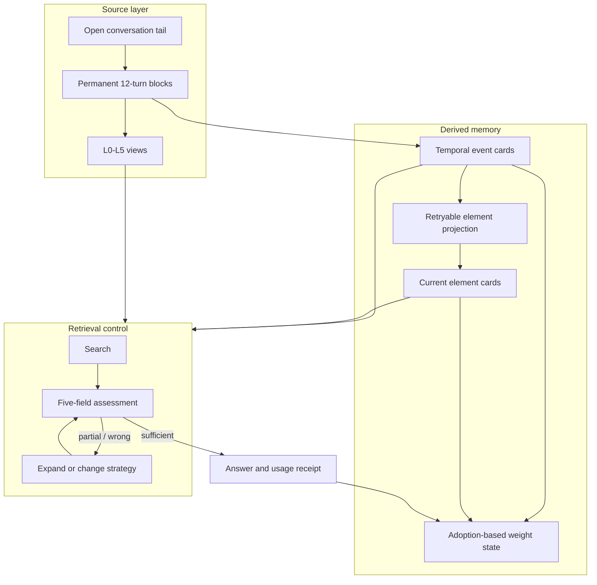

# StrataGate architecture

StrataGate separates source preservation, derived memory, retrieval control, and reinforcement. Combining these responsibilities makes it easy for a summary mistake or a ranking feedback loop to become an apparently certain answer.

## System boundaries



The data flow from blocks to event cards and from events to element cards is one-way. Derived cards never rewrite their source block or source event.

## Conversation blocks

A completed user/assistant pair is one turn. The default block boundary is 12 completed turns. Messages that have not reached the boundary remain in the open tail and are not condensed or extracted.

When the boundary is reached:

1. L5 stores the raw messages and tool traces.
2. L4 converts tool payloads into readable summaries while preserving natural-language turns.
3. L3 applies a deterministic, bounded condensation policy.
4. A caller-provided summarizer produces L0-L2 and a conservative `shouldExtract` decision.
5. The block pointer starts at L5 and decays toward L0 as later turns accumulate.

The block weight is:

```text
w(t) = exp(-0.05 * t)

t = current turn - pointer anchor turn
```

The weight selects how many levels to drop from the pointer anchor. Expanding a block to L3 anchors the pointer at L3; it does not silently jump to L5.

## Deterministic L3 policy

L3 may remove only:

1. standalone greetings or acknowledgements;
2. standalone pure confirmations;
3. raw tool-call argument payloads, while retaining tool name and a bounded result summary;
4. exact repeated long pasted text or code after the first occurrence.

Short repeated natural-language messages are retained. L3 never performs semantic paraphrasing.

## Delayed event extraction

If block `N` is marked as a candidate, precise extraction waits until block `N+1` is sealed. The extractor receives:

- previous block `N-1` for context, if it exists;
- target block `N`, including its L5 source;
- next block `N+1` for context;
- a compact timeline of existing event IDs, titles, and temporal fields.

The target is the only legal source of new facts and quotations. Source message IDs are checked against the target block. The reference implementation falls back to all target messages when an extractor returns no valid source ID; stricter adapters may reject the card instead.

## Event-card contract

An event card stores content, provenance, time, governance, and weight separately.

```ts
interface EventCard {
  id: string;
  title: string;
  summary: string;
  narrative: string;
  tags: string[];
  quotes: string[];

  sourceBlockId: string;
  sourceMessageIds: string[];

  temporal: {
    mentionedAt?: string;
    happenedStart?: string;
    happenedEnd?: string;
    originalText?: string;
    precision?: 'instant' | 'day' | 'month' | 'year' | 'range' | 'unknown';
    basis?: 'explicit' | 'relative' | 'inferred' | 'unknown';
    status?: 'occurred' | 'planned' | 'cancelled' | 'ongoing' | 'unknown';
    participants?: string[];
    eventType?: string;
    supersedesEventIds?: string[];
    conflictsWithEventIds?: string[];
  };

  status: 'active' | 'superseded' | 'forgotten' | 'archived';
  weight: MemoryWeight;
}
```

`mentionedAt` answers when the conversation referred to the event. `happenedStart` and `happenedEnd` answer when the event itself occurred. Keeping these axes separate avoids treating the message timestamp as the event date.

## Element-card projection

Event cards are immutable history. Element cards are rebuildable materialized views across events for people, projects, organizations, tools, and places. Each element fact has one of three modes:

- `state`: a new fact with the same key supersedes the previous active state;
- `set`: new unique values are appended without replacing existing values;
- `relation`: a new relation with the same key supersedes the previous active relation.

Facts carry `validFrom`, optional `validTo`, confidence, and `sourceEventIds`. Replacing a state closes the previous fact's validity interval instead of deleting it. `expandElement(id, at)` can therefore reconstruct the view at an earlier time.

Projection is a separate persisted job from event extraction. The runtime commits a `pending` job only after its events exist. It then claims the job, calls the application-provided projector outside the transaction, and atomically applies the result or records failure. Every proposed fact is ignored unless all of its source event IDs belong to the claimed batch. An interrupted `running` job becomes `failed` on restart and can be retried without re-extracting events.

Applications that manage their own model loop may use `claimNextElementProjection()`, `completeElementProjection()`, and `failElementProjection()` directly. Supplying `elementProjector` lets `appendTurn()` and `resumePendingWork()` drive the same state machine automatically.

## Hybrid retrieval

Event and fact-level element search use two inspectable ranking sources:

1. BM25 over field-weighted lexical tokens, including overlapping Han bigrams;
2. structured rankings from fields such as participant, event type, time range, element name, and element type.

Reciprocal-rank fusion combines the available rankings. A non-empty query with no lexical or structured match returns an empty result rather than all candidates. Element search returns the matched fact plus its element ID, validity interval, and event provenance; callers expand the full element card only when needed. The reference path does not use embeddings or vector similarity.

## Event weight and adoption

Event decay uses:

```text
w(t, n) = max(floor, exp(-lambda(n) * t))
lambda(n) = 0.15 / (1 + 1.5 * ln(n))
```

`n` is the number of recorded adoptions, not retrieval hits. Search updates `lastRetrievedAt` for observability, while `recordMemoryUse()` increments the adoption count and moves the decay anchor.

Criticality floors in the reference implementation are:

| Criticality | Floor |
| --- | ---: |
| routine | 0.0 |
| preference | 0.3 |
| identity | 0.9 |
| safety | 1.0 |

A pinned event has effective weight 1. A superseded event is capped at 0.1. Forgotten and archived events have effective weight 0.

## Retrieval assessment contract

The assessment contract is deliberately small:

```ts
interface RetrievalAssessment {
  verdict: 'sufficient' | 'partial' | 'wrong';
  evidenceRefs: string[];
  fit: string;
  missing: string;
  nextStrategy:
    | 'answer'
    | 'search_events'
    | 'expand_event'
    | 'search_elements'
    | 'expand_element'
    | 'search_raw_memory'
    | 'expand_block';
}
```

Normalization enforces three conditions before `sufficient` is accepted:

1. at least one evidence ID belongs to the latest retrieval batch;
2. the chosen next strategy is `answer`;
3. the assessment uses the bounded schema rather than carrying a growing private scratchpad.

If the retrieval budget ends without sufficient evidence, the caller should pass the full retrieval transcript to the answer model and require explicit uncertainty. The core exposes the gate; applications own the tool loop and final model call.

## Storage adapters

`StrataGate.open({ database, namespace })` is the normal public entrypoint and always hydrates the state machine from transactional SQLite storage. `StrataGate.inMemory()` is an explicit test and ephemeral-use mode. Advanced integrations may supply another durable `StorageAdapter` through `StrataGate.openWithStorage()`. The bundled `SqliteStorage` adapter persists normalized rows for memory spaces, messages, blocks, events, elements, facts, provenance links, extraction/projection jobs, usage receipts, and idempotent external-turn ingestion receipts.

Every namespace has a monotonically increasing revision. A write supplies the revision it loaded; SQLite commits the new revision and all related rows in one immediate transaction. A stale process receives `StorageConflictError` rather than overwriting newer state.

External model calls are never made inside a database transaction:

1. a completed raw turn is committed immediately;
2. summarization runs outside the transaction, then sealing commits atomically;
3. extraction first commits a running job, calls the extractor, then atomically commits either the event cards or a failed/skipped job state;
4. element projection follows the same claim/call/complete boundary after its source events are durable;
5. `resumePendingWork()` retries only failed or interrupted work after restart.

The adapter preserves these invariants:

- blocks and L5 messages are append-only;
- card provenance references an existing source block and message set;
- search hits do not increment adoption state;
- supersession retains the old event;
- element state replacement retains the old fact and its validity interval;
- every element and fact source references an existing immutable event;
- forget is reversible unless an application explicitly implements irreversible deletion;
- usage receipts are idempotent for one answer turn through a unique `receiptId`.

SQLite schema v2 adds normalized element, fact, provenance, and projection-job tables. Opening a schema-v1 database migrates it in one transaction and preserves existing namespaces, blocks, events, jobs, and receipts. SQLite uses WAL, foreign keys, and per-namespace optimistic concurrency. It does not provide encryption at rest. Search still uses the reference in-memory ranking after hydration, so enabling persistence does not silently change retrieval semantics. Database-native lexical/vector indexes and a Postgres implementation remain separate future work.
